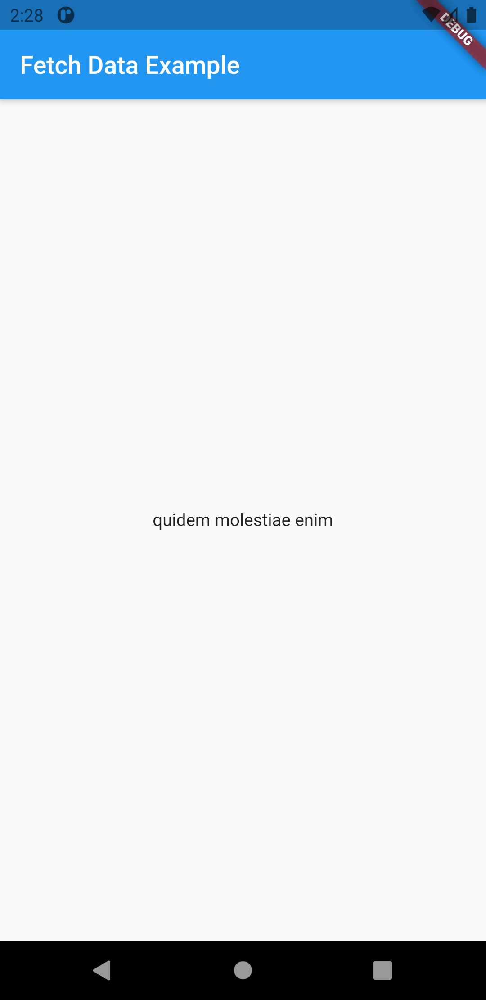

# fetch_data_from_internet

Fetching data from the internet is necessary for most apps. Luckily, Dart and Flutter provide tools, such as the http package, for this type of work.

<table>
  <tr>
    <td>Data</td>
  </tr>
  <tr>
    <td></td>
    <!-- <td></td> -->
 
  </tr>
 </table>